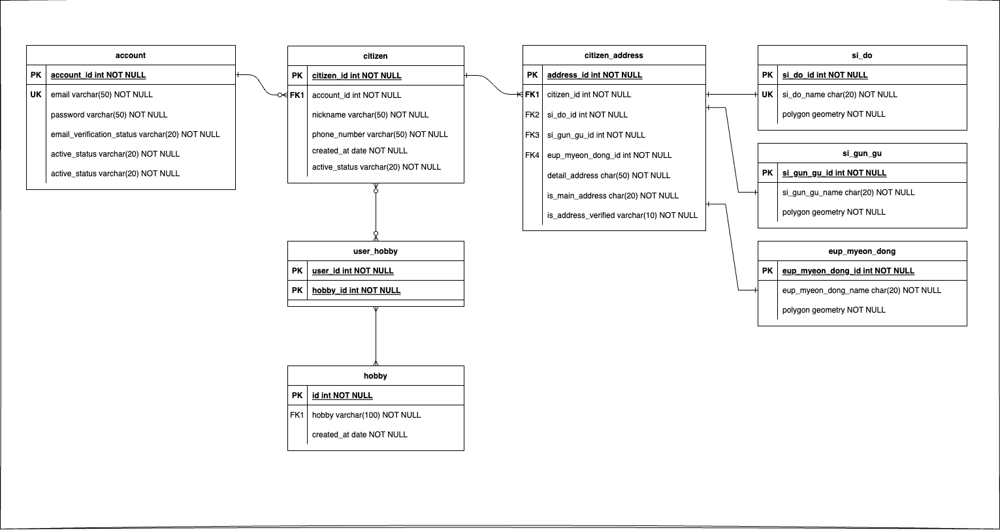
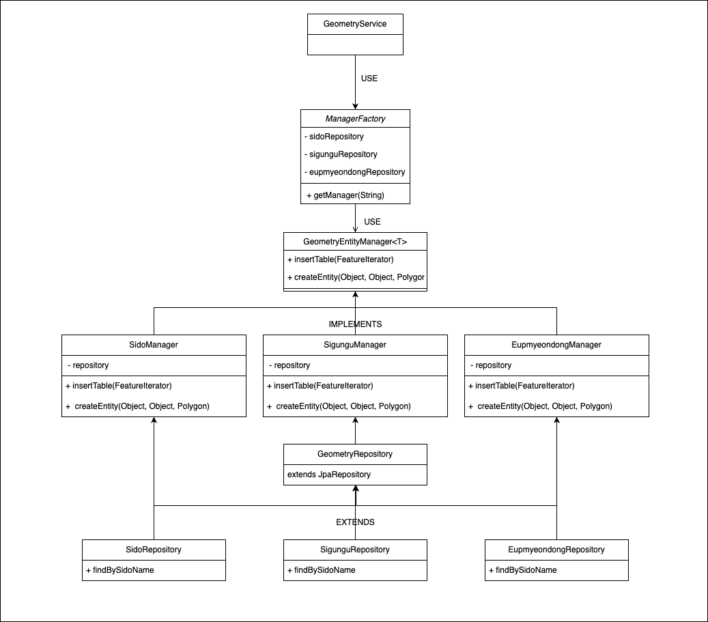

# 웃찾사

2023.07.01 ~ 2023.07.17

https://github.com/choomi1217/neighbor.git

## **같은 취미, 같은 동네 사람들의 애플리케이션**

---

### 🔧 API 설계

- 사용자 ( account )
    - 사용자 등록 `POST /accounts`
        - 최초 가입시 유저 정보가 없이 email과 password만 필요
    - 사용자 수정 `PUT /accounts`
        - Authentication required
        - phoneNumber, email 수정
    - 사용자 삭제 `DELETE /accounts`
    - 사용자 로그인 `POST /accounts/login`
        - 이메일 인증이 된 계정은 주민목록을 불러오도록 함.
        - 이메일 인증이 안 되면 주민등록을 할 수 없는 로직이라서 가능한 부분.
    - 사용자 로그아웃 `GET /accounts/logout`
        - 로그아웃은 서버에 저장된 세션을 제거하거나 클라이언트의 쿠키를 삭제하는 등의 작업을 포함합니다. 이러한 작업은 서버의 상태를 변경시키기 때문에, 이를 **`POST`**로 처리했습니다.
    - 사용자 이메일 인증 `POST /accounts/{id}/email-verification`
        - 사용자 등록 후, 주민등록을 하려면 이메일 인증이 필요함
    - 사용자 비밀번호 인증 `POST /accounts/{id}/password-verification`
        - 사용자 삭제 전 비밀번호 인증
        - 어드민 사용자 목록 조회 `GET /accounts`
    - 어드민 사용자 조회 `GET /accounts?username=james& ....`
- 주민 ( citizen **)**
    - 주민 등록 `POST /citizen`
        - 이메일 미인증시 예외 발생
    - 주민 수정 `PUT /citizen`
        - nickname, address 수정
    - 주민 삭제 `DELETE /citizen`
    - 같은 취미의 주민 찾기 `GET /citizen?hobby=...`
- 주소 ( address )
    - 주소 등록 `POST /address`
    - 주소 수정 `POST /address`
    - 주소 삭제 `DELETE /address`
    - 주소 인증 `POST /adress-verification/14142624.894167583,4505768.030621257`
        - Front-end에서 OpenLayers의 GeoLocation을 통해 들어온 GPS 데이터를 받아서 처리합니다.
        - request 형태는 {x, y} ‘ 14142624.894167583,4505768.030621257 ’입니다
    - 근처 주소 찾기 `GET /address?sido=&sigungu=&eupmyeondong=...`
        - 시도 범위 (다중선택)
        - 시군구 범위 (다중선택)
        - 읍면동 범위 (다중선택)
    - 본인 위치 주변 찾기 `GET /address/14142624.894167583,4505768.030621257`
- 예외

---

### 🔧 기능

- 자바 17
- 스프링 3.1.1
    - 웹 소캣
        - 채팅
    - 스프링 배치
        - 매월 데이터
    - 스프링 시큐리티
- 스웨거
- postgres
    - postgis

---

### 🔧설계도


---

### 🔧 참고

- **springBoot Websocket**

[Realtime Chatroom application - SpringBoot, Websocket, ReactJS](https://www.youtube.com/watch?v=o_IjEDAuo8Y)

- **RestAPI 설계**

[RESTful API 설계 가이드](https://sanghaklee.tistory.com/57)

[REST API 제대로 알고 사용하기 : NHN Cloud Meetup](https://meetup.nhncloud.com/posts/92)

- **architecture**

아래 링크를 통해 4-tierLayer와 jpa를 쓰면서 여러번 myBatis 쓰고 싶단 생각을 했습니다.

왜냐하면 Entity 클래스가 DB의 테이블과 똑같이 생기지 않으면 에러를 뱉어댔으며 이 때문에 Entity를 중간에 가공하는 과정이 있어야 했습니다.

이 과정이 생각보다 번거로웠습니다.

번거로운건 하면 되지만 그 **Domain과 Entity 사이의 변환하는 과정이 전부 Service로 와버리니 이건 비즈니스 로직이 아니란 생각이 계속 들었습니다.**

그래서 어떻게 해야 좋을지 고민을 했고 아래와 같은 방식으로 패키지를 구성했습니다.

**Domain과 Entity 사이의 간극을 Dao로 메우고자 했습니다.**

[**🔧** 느낀점](https://www.notion.so/34ef725520e9424aaa479652d4ea19a8?pvs=21)


- 공간정보

데이터는 아래 링크들에서 가져왔습니다.

도로명의 경우에 너무 크고 토이 프로젝트이기 때문에 가져오지 않았습니다.

[대한민국 최신 행정구역(SHP) 다운로드](http://www.gisdeveloper.co.kr/?p=2332)

- Spring Security
    - 로그아웃

      [[Spring Security] Logout 처리](https://velog.io/@dailylifecoding/spring-security-logout-feature)


---

### 🤔 고민

- Account와 Member
    - email이 UK임에도 account_id를 PK 삼은 이유 : email은 바뀔 수 있기 때문에

```java
@Entity
public class AccountEntity {
    @Id
    @GeneratedValue(strategy = jakarta.persistence.GenerationType.IDENTITY)
    private Long accountId;
    private String email;
    private String password;
    private boolean isEmailVerified;
    private boolean isActive;
}
```

- Service에서 필요한 Entity의 Id
    - 아래와 같이 서비스 로직에서 엔터티의 id가 필요한 일이 생겼다..
    - 도메인과 엔터티를 분리하고 싶었는데 하는 수 없이 엔터티에 id를 넣을 수 밖에 없었다.
    - 그러고선 한참을 구글링을 하고 찾아다닌 끝에 아래와 같은 내용을 챗gpt를 통해 들었다.

<aside>
💡 레이어의 책임과 역할에 따라, **`Domain`** 객체에서 **`id`**를 포함시키는 것도 고려해볼 수 있습니다. DDD(Domain-Driven Design)에서는 Aggregate Root가 고유 식별자를 가져도 좋다는 점을 강조합니다. 그래서 도메인 객체에서도 id를 가질 수 있으며, 이는 JPA의 **`Entity`**와의 변환 과정에서 유지될 수 있습니다.

</aside>

```java
// AccountService login method
public LoginResponse login(LoginRequest loginRequest) {
        Account account = accountRepository.findByEmail(loginRequest.email());
        if(!passwordEncoder.matches(loginRequest.password(), account.password())){
            // todo: 비밀번호 불일치 예외 처리
            throw new IllegalArgumentException("Password is not matched");
        }
        if(account.isEmailVerified()){
            userService.findUserByAccountId(account.id());
        }
        return new LoginResponse(
            account.email(), account.phoneNumber(), null
        );
    }

// Account Record
public record Account (Long accountId, String email, String password, String phoneNumber, boolean isEmailVerified, boolean isActive) {

    public Account(String email, String password, String phoneNumber) {
        this(null, email, password, phoneNumber, false,  true);
    }
}
```
