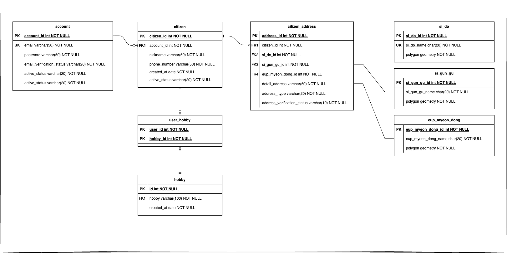

# 웃찾사

2023.07.01 ~ 2023.07.17

https://github.com/choomi1217/neighbor.git

## **같은 취미, 같은 동네 사람들의 애플리케이션**

---

### 🔧API 설계

- 사용자 ( account )
    - 사용자 등록 `POST /accounts`
        - 최초 가입시 유저 정보가 없이 email과 password만 필요
    - 사용자 수정 `PUT /accounts`
        - Authentication required
        - phoneNumber, email 수정
    - 사용자 삭제 `DELETE /accounts`
    - 사용자 로그인 `POST /accounts/login`
        - 이메일 인증이 된 계정은 주민목록을 불러오도록 함.
        - 이메일 인증이 안 되면 주민등록을 할 수 없는 로직이라서 가능한 부분.
    - 사용자 로그아웃 `GET /accounts/logout`
        - 로그아웃은 서버에 저장된 세션을 제거하거나 클라이언트의 쿠키를 삭제하는 등의 작업을 포함합니다. 이러한 작업은 서버의 상태를 변경시키기 때문에, 이를 **`POST`**로 처리했습니다.
    - 사용자 이메일 인증 `POST /accounts/{id}/email-verification`
        - 사용자 등록 후, 주민등록을 하려면 이메일 인증이 필요함
    - 사용자 비밀번호 인증 `POST /accounts/{id}/password-verification`
        - 사용자 삭제 전 비밀번호 인증
        - 어드민 사용자 목록 조회 `GET /accounts`
    - 어드민 사용자 조회 `GET /accounts?username=james& ....`
- 주민 ( citizen **)**
    - 주민 등록 `POST /citizen`
        - 이메일 미인증시 예외 발생
    - 주민 수정 `PUT /citizen`
        - nickname, address 수정
    - 주민 삭제 `DELETE /citizen`
    - 같은 취미의 주민 찾기 `GET /citizen?hobby=...`
- 주소 ( address )
    - 주소 등록 `POST /address`
    - 주소 수정 `POST /address`
    - 주소 삭제 `DELETE /address`
    - 주소 인증 `POST /adress-verification/14142624.894167583,4505768.030621257`
        - Front-end에서 OpenLayers의 GeoLocation을 통해 들어온 GPS 데이터를 받아서 처리합니다.
        - request 형태는 {x, y} ‘ 14142624.894167583,4505768.030621257 ’입니다
    - 근처 주소 찾기 `GET /address?sido=&sigungu=&eupmyeondong=...`
        - 시도 범위 (다중선택)
        - 시군구 범위 (다중선택)
        - 읍면동 범위 (다중선택)
    - 본인 위치 주변 찾기 `GET /address/14142624.894167583,4505768.030621257`
- 예외

---

### 🔧흐름도

---

### 🔧기능

- java 17
  - geo coding
- spring 3.1.1
    - security
- swagger
- postgres
    - postgis

---

### 🔧설계도

---
